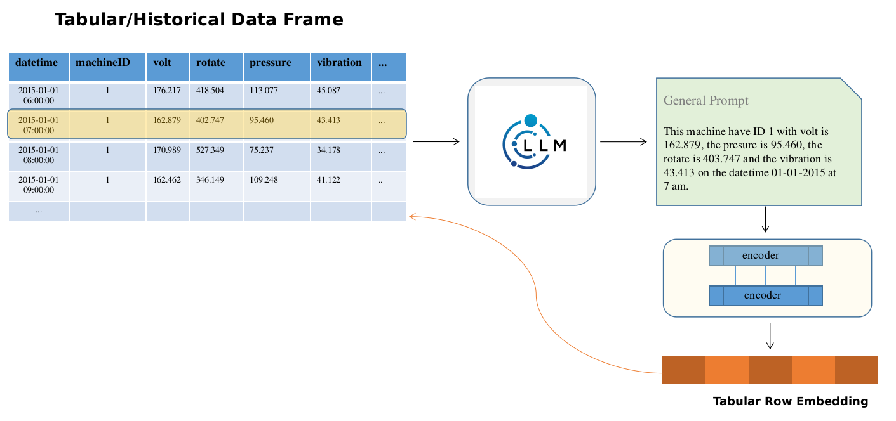

# Predictive Maintenance with AI
AI-Driven Predictive Maintenance Application with Language Models

Introduce some simple approaches to handle this data, and also try to test a very light-weight LLM approach to demonstrate the idea of using LLM for historical data. Regarding the application, I use Streamlit to create a basic web application for this equipment failure prediction problem, later on, we can enhance and customize the Streamlit app by adding more components, visualizations, and interactive features to make it more user-friendly and informative.

**Keywords:** Tabular, Boosting, LLM, Streamlit.



## Main features
* A basic example of a full Python-based project that includes a backend with endpoints to receive historical sensor data and a front-end interface using Streamlit to visualize and prepare the data for processing by an AI model.
* Some simple boosting and time series methods (LSTM) have been tested with naive feature selection.
* Light-weight LLM using Distilbert model to create the tabular embedding with small tokenizer_max_length 16

## Requirements
- pytorch
- streamlit
- flask
- scikit-learn
- xgboost
- joblib
- imblearn
- 'arize[AutoEmbeddings]'
- lamma-cpp-python [optional]
- transformer [optional]

## Dataset
**Summary of Telemetry Data Observations:**
- The data in question possibly consists of artificially generated records spanning from January 1, 2015, to January 1, 2016. 
- Each row corresponds to a specific machine's condition during a given hour.  
- The dataset comprises readings from 100 distinct machines and is devoid of any duplicated entries or missing values. 
- The four metrics—voltage, vibration, pressure, and rotation—follow a normal distribution pattern. 
- The labels show this is very imbalance dataset

## Getting Start
**Training:**
``` bash
# Download data from this link: https://www.kaggle.com/datasets/arnabbiswas1/microsoft-azure-predictive-maintenance?sort=recent-comments
mkdir data; data/origin
# Then extract it to  data/origin/ to train the model, or you can download *feather file and put directly to data/
python train.py --model [x,r,l,lm]
```
**Serving:**
```bash 
# Run:
streamlit run app.py
#From the open localhost, upload the csv files, the press Predict button
```
## TO DO:
- [ ] Explore in deep the data and do feature engineering
- [ ] Increase the embedding tokenizer_max_length
- [ ] Test more LLM approaches
- [ ] Live deployment on Heroku, Render or Azure instead of local.

## Reporting Issues and Feedbacks


